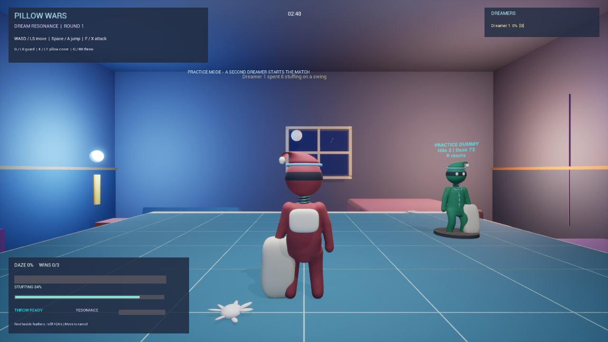

# Pillow Wars: Dream Resonance

A student-built Unreal Engine 5.5.3 party-combat prototype: small pajama ninjas, oversized pillows, spring-neck bobbleheads, and a bedroom turned into a battleground.

## Play without Unreal

**[Download Pillow Wars for Windows - v0.3.0 (451 MB)](https://github.com/Convexitys/PillowWars/releases/download/v0.3.0/PillowWars-v0.3.0-Windows.zip)**

1. Download the complete game ZIP above. GitHub's green **Code > Download ZIP** is source code, not the playable game.
2. Extract the entire ZIP, then open the `Windows` folder and run `PillowWars.exe`.
3. Keep its `Engine` and `PillowWars` folders beside it. The EXE alone is not the game.
4. Select **Practice** for solo play. Read `READ-ME-FIRST.md` for controls and local-network hosting instructions.

[Release notes and checksum](https://github.com/Convexitys/PillowWars/releases/tag/v0.3.0). The uploaded ZIP matches the original SHA-256 and passed archive-integrity checks. This verifies the download artifact, not the unfinished independent-computer gameplay tests described below.

Windows 64-bit only. A compatible graphics card and Microsoft Visual C++ runtime are required. The build includes the Unreal prerequisite installer. No Unreal Editor installation is needed to play. macOS, Linux, mobile, and browser play are not supported by this Windows build. The executable is unsigned; no code-signing certificate is included.

This repository contains the custom C++ gameplay source, sanitized default configuration, screenshots, and test documentation. It is **not a complete clone-and-run Unreal project**: the editor's binary content, Epic template/Starter Content dependencies, and development-only MCP plugin are not in this public source snapshot. See [asset/build scope](docs/ASSETS-AND-BUILD.md). The packaged game is the player-facing distribution.

## The game loop

- Tap **F** to cycle left/right/overhead pillow swings. Hold **F** for up to two seconds, then release for a charged circular uppercut.
- Hits build Daze, increasing later knockback. Win by being the last dreamer standing; the match tracks first-to-three round wins.
- Attacks and blocking spend pillow stuffing. Stop beside a feather pile to crouch and restuff; moving or attacking interrupts it.
- Throw a gravity-affected back pillow with **Q**, then wait 15 seconds for it to recharge.
- Guard, create temporary pillow cover, and use the Resonance timing window to turn defense into an opportunity.

## Controls

| Action | Keyboard |
| --- | --- |
| Menu navigation / select | Arrow keys / Enter |
| Movement / camera / jump | WASD / mouse / Space |
| Three tap swings / charged uppercut | Tap F / hold F and release |
| Guard / temporary pillow cover / throw | G / E / Q |
| Pause / back | Esc |
| Lobby character selection / ready | C / Enter |
| Open LAN host / start match | H to open host; H again after both/all players are ready |
| Join by IPv4 address | Join Party menu, or J in lobby |
| Round reset / rematch vote | R |

For solo testing, select **Practice**. A labeled character dummy reports hits and Daze; it does not count as a player. Gamepad bindings are shown in-game but have not received the same fresh physical-controller QA as keyboard input.

## Multiplayer scope

Designed around a listen host and direct IPv4 joining. Use the same game version on both Windows computers. This is not Steam/Epic matchmaking and does not provide party invites, NAT traversal, or a relay service. Separate-network Internet connectivity is not yet verified; do not assume a friend on another network can connect automatically. Do not disable your firewall to troubleshoot.

Host: open Play / Party Lobby and press **H** to open port 7777. Share your LAN IPv4 address privately with the other tester. The other tester uses **Join Party** and that address. Each player presses **Enter** to ready up; the host presses **H** again to start. Hosting alone does not start a match; use Practice for solo play. The latest host-button regression passed 4/4 editor checks. Final packaged-game and independent-PC networking remain unverified.

Current verification: **16/16 single-player checks, 57/57 two-player regression checks**, and **12/12 smoke checks across real 8-player and 10-player same-process PIE sessions**. Tests use normal player key handlers with controlled test positions/resources. See [test evidence and limits](docs/TESTING.md). These are automated engineering checks, not proof of fun, final animation quality, or independent-machine networking.

## Implementation

Unreal C++, replicated player/match state, server-authoritative contact sweeps and damage, procedural poseable-mesh animation, generated character geometry, and editor-Python test/capture scripts. Original character and furniture asset preparation used Python and Blender. Development used AI assistance; the repository does not claim every line or asset was produced unaided.

Start with `PillowWarsGameMode.cpp` (rules/resources), `PillowWarsWeapon.cpp` (pose/contact/replication), `PillowWarsPlayerController.cpp` (input/frontend), and `PillowWarsMatchState.cpp` (state/HUD) under `Source/PillowWars/`.

## Submission

Prepared for Next Byte Hacks: V4. [Official rules](https://next-byte-hacks-v4.devpost.com/rules) require a project description, tech stack, and a public code repository. See [submission checklist](docs/SUBMISSION.md). Eligibility, team details, and the work's event-date compliance must be confirmed by the team. No placement or prize is guaranteed.
